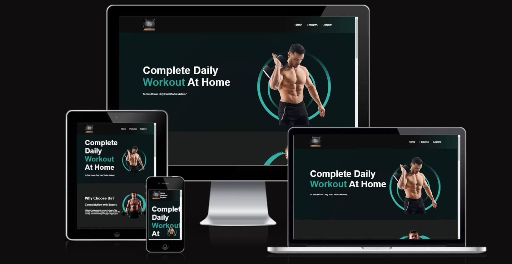
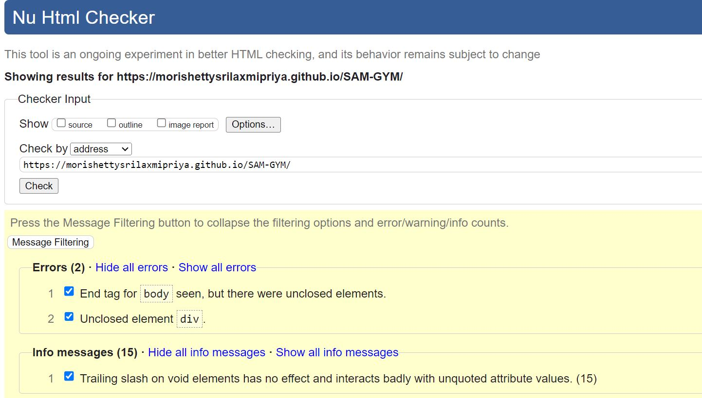

 <h1>GYM</h1>

Created to provide guidance and inspiration to the people interested in taking care of their health and body. This site is for those who are interested in exercising and keeping their body fix and in shape. This site is made for educational purpose only.

<h2>Existing Features</h2>

<h3>Navigation Bar</h3>

This is featured on all the three pages of the website. The Responsive navigation bar allows the users to move between the pages easily without having to use thr back button.The image I have choosen is representative of the site's theme and incorporates the colour palette, it immediately encourages the user to think of being fit.

It contains links to the Logo page, the Home Page, Features Page and the Explore Page.

image.png

<h4>The Landing Page</h4>

<h4>Home</h4>

Complete Daily Workout at Home.

In this House Only 'HardWorks Matters'.
And there will a picture od the trainee.

<h4>Features</h4>

This page is about Why to Choose Us.
Consultation with Experts.
It has the friendly independently run gym in heart of the country. We
consider our gym one of the best in the country, accommodating every
type of gym goer. This page give the information why to choose and consult with experts with a visual image which insprises user to join the GYM.

<h4>Explore</h4>

Explore Our Fitness Studio.

1.Personal training is PERSONAL.

2.Personal training is educational.

3.Personal training is results driven 1:1 training is something we
recommend to absolutely everyone.

4.You could be a stay at home mom looking to loose a dress size for
that wedding coming up...

5.Or a director of a company who is lacking energy with his or her
busy lifestyle.

6.Or a young athlete that needs more power in his or or her giving
sport.

 <h4>Footer Section</h4>

This section contain the copyright logo.

<h3>Technologies Used</h3>

I have used several technologies that have enabled this design to work:

[HTML:](https://www.html.com) 
Used as the basic building block for the project and to structure the content. 
[CSS:](https://www.css.com) 
Used to style all the web content across the project. 
[Google Fonts:](https://www.fonts.google.com) 
Used to obtain the fonts linked in the header, fonts used were Playfair and Cookie. 
[Google Developer Tools:](https://www.developer.chrome.com.com) 
Used as a primary method of fixing spacing issues, finding bugs, and testing responsiveness across the project. 
[GitHub:](https://www.github.com) 
Used to store code for the project after being pushed. 
[Git:](https://www.git.com) 
Used for version control by utilising the Codenywhere terminal to commit to Git and Push to GitHub. 
[W3C Markup Validation Service:](https://validator.w3.org/) 
Used to validate all HTML code written and used in this webpage. 
[W3C CSS Validation Service:](https://jigsaw.w3.org/css-validator) 
Used to validate all CSS code written and used in this webpage. 
[Freeformatter CSS Beautify:](https://www.freeformatter.com/css-beautifier.html)  
Used to accurately format my CSS code. 
[Freeformatter HTML Formatter:](https://www.freeformatter.com/css-beautifier.html)  
Used to accurately format my HTML code. 
[AmIResponsive:](https://ui.dev/amiresponsive)  
Used to generate repsonsive image used in README file. 

<h3>Testing</h3>

1.This page works on different browsers: Chrome, Microsoft Edge, Firefox. 
2.On smaller screen sizes the logo is located at the top of the navigation bar. 
3.I checked that the page is responsive, works and looks good on the standard screen sizes (ipad, MotoG4, iphone6/7/8, iphone5/SE and Galaxy S5) using the devtools device toolbar. 
4.I have checked that the above mentioned features work as expected, the form requires entry on each field, the email field accepts only email address and the checkbox requires that the user checks it before submission, and the submit button allows the user to submit feedback. 

<h3>Validator Testing</h3>
<h4>HTML</h4>
Errors were detected when passing through the official W3C validator and they are corrected. There was a warning but it was not relevant to the indicated section of the code. 

 

<h3>CSS</h3>
[CSS Validation:](https://jigsaw.w3.org/css-validator/validator?uri=https%3A%2F%2Fmorishettysrilaxmipriya.github.io%2FSAM-GYM%2F&profile=css3svg&usermedium=all&warning=1&vextwarning=&lang=en)  

<h2>Deployment:</h2> 

1.The site was deployed to GitHub pages as follows: 
i.In the GitHub repository, navigate to the Settings tab. 
ii.From the source section drop-down menu, select the Master or Main Branch. 
iii.Once the master or main branch has been selected, the page will be automatically refreshed with a detailed ribbon display to indicate the successful deployment. 

The live link can be found here: (https://morishettysrilaxmipriya.github.io/SAM-GYM/)  

<h3>Credits</h3> 

1.Base code Reference: 
I leveraged the Love Running project as a foundational template for developing my code. Drawing upon the knowledge acquired during the project walkthrough, I applied key concepts and techniques to tailor the code to my specific needs. Additionally, I referred to the source code for troubleshooting and resolving issues in my implementation. The Code Institute's learning platform Code Institute. served as a valuable resource throughout this process."  

2.AI Search Engines:  
[OpenAI Chat](https://chat.openai.com/)  
[Perplexity](https://www.perplexity.ai/) 

3.Readme References 
[John Meditation GitHub](https://github.com/Joh201/john-meditation) 
[La Petite Traveller GitHub](https://github.com/daisygunn/la-petite-traveller)  

4.Code Validator:  
[W3C Jigsaw Validator](https://jigsaw.w3.org/)  

5.The social media logos were taken from wikipedia.
